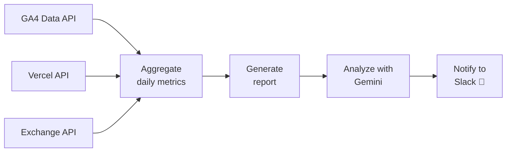

# P.V.V.C

<div align="center">


### Page Views Vercel Cost

GA4のページビューとVercelのホスティングコストを取得・比較し、  
**トラフィックとコストのバランスを可視化・分析する** CLIツール

</div>

---

## Overview

**P.V.V.C** は、GA4のPVとVercelのホスティングコストを並べて見ながら、  
日々のトラフィック推移とコスト効率を把握するためのCLIツールです。

日別レポートの出力に加えて、為替レートを用いたJPY換算、  
Geminiによる分析コメント生成、Slack通知まで自動化できます。

---

## Features

- 直近14日分の **GA4 PV / Vercel Cost / USDJPY** を自動取得
- 日別メトリクスを **CLIテーブル** で見やすく表示
- **Cost per PV** を算出し、コスト効率を可視化
- Gemini AI によるトレンド分析コメントを生成
- Slack への通知に対応
- `.env` ベースでシンプルに設定可能

---

## Architecture



## Flow

1. **Load configuration**
   - `.env` または環境変数から認証情報を読み込みます

2. **Fetch metrics**
   - GA4 Data API からページビューを取得
   - Vercel API からホスティングコストを取得
   - 為替APIから USD/JPY レートを取得

3. **Build report**
   - 日別データを集計し、ターミナル上に表形式で出力します

4. **Analyze trends**
   - Gemini に集計データを渡し、傾向や変化点のコメントを生成します

5. **Send notification**
   - サマリーと分析結果を Slack Incoming Webhook で送信します

---

## Configuration

プロジェクトルートに `.env` を作成してください。

```env
# Vercel
VERCEL_TOKEN=<Vercel API Token>
TEAM_ID=<Vercel Team ID>

# Google Analytics 4
PROPERTY_ID=<GA4 Property ID>
GOOGLE_ANALYTICS_CREDENTIAL=<Service Account JSON string>

# AI
GEMINI_API_KEY=<Gemini API Key>

# Slack
SLACK_WEBHOOK_URL=<Incoming Webhook URL>

# Optional
TARGET_WEBSITE_NAME=<Website Name>
```

---

## Usage

### Generate daily report

```bash
pvvc report
```

### Run AI analysis

```bash
pvvc analyze
```

### Send analysis to Slack

```bash
pvvc analyze --notify
```

---

## Commands

| Command                 | Description                            |
| ----------------------- | -------------------------------------- |
| `pvvc report`           | 直近14日分のPV・コストレポートを出力   |
| `pvvc analyze`          | AIによるトラフィック・コスト分析を実行 |
| `pvvc analyze --notify` | 分析結果をSlackに通知                  |

---

## Example Output

```text
Date         PV       Cost(USD)    Cost(JPY)    Cost/PV(USD)    Cost/PV(JPY)    USD/JPY
2026-04-01   18,234   12.40       1886.12     0.00068        0.1034         152.11
2026-04-02   17,620   11.98       1821.76     0.00068        0.1034         152.07
2026-04-03   19,402   13.21       2008.57     0.00068        0.1035         152.05
...
```

---

<small>2026 [Aoki Mizuki](https://github.com/4okimi7uki) – Developed with 🍭 and a sense of fun.</small>
