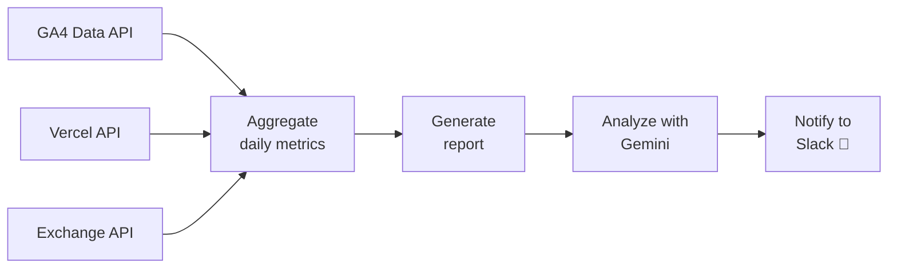

# P.V.V.C

<div align="center">


### Page Views Vercel Cost

GA4のページビューとVercelのホスティングコストを取得・比較し、  
**トラフィックとコストのバランスを可視化・分析する** CLIツール

</div>

---

## Overview

**P.V.V.C** は、GA4のPVとVercelのホスティングコストを並べて見ながら、  
日々のトラフィック推移とコスト効率を把握するためのCLIツールです。

日別レポートの出力に加えて、為替レートを用いたJPY換算、  
Geminiによる分析コメント生成、Slack通知まで自動化できます。

---

## Features

- 直近7日分の **GA4 PV / Vercel Cost / USDJPY** を自動取得（`--from` / `--to` で期間変更可能）
- 日別メトリクスを **CLIテーブル** で見やすく表示
- **Cost per PV** を算出し、コスト効率を可視化
- Gemini AI によるトレンド分析コメントを生成
- Slack への通知に対応
- `pvvc init` による **インタラクティブな初期設定**
- `.env` または `~/.config/pvvc/config.toml` で設定可能

---

## Architecture



## Flow

1. **Load configuration**
   - 環境変数 / `.env` / `~/.config/pvvc/config.toml` から認証情報を読み込みます（優先度順）

2. **Fetch metrics**
   - GA4 Data API からページビューを取得
   - Vercel API からホスティングコストを取得
   - 為替APIから USD/JPY レートを取得

3. **Build report**
   - 日別データを集計し、ターミナル上に表形式で出力します

4. **Analyze trends**
   - Gemini に集計データを渡し、傾向や変化点のコメントを生成します

5. **Send notification**
   - サマリーと分析結果を Slack Incoming Webhook で送信します

---

## Configuration

### 推奨: pvvc init

インタラクティブな初期設定コマンドで、認証情報を対話形式で入力できます。  
設定は `~/.config/pvvc/config.toml` に保存されます。

```bash
pvvc init
```

### 手動設定: 環境変数 / .env

プロジェクトルートに `.env` を作成するか、環境変数として設定してください。  
環境変数は config ファイルより優先されます。

```env
# Vercel
VERCEL_TOKEN=<Vercel API Token>
TEAM_ID=<Vercel Team ID>
PROJECT_ID=<Vercel Project ID>

# Google Analytics 4
PROPERTY_ID=<GA4 Property ID>
GOOGLE_ANALYTICS_CREDENTIAL=<Service Account JSON string>

# AI
GEMINI_API_KEY=<Gemini API Key>

# Slack
SLACK_WEBHOOK_URL=<Incoming Webhook URL>

# target web site name
TARGET_WEBSITE_NAME=<Website Name>
```

> **設定の優先度:** 環境変数 / `.env` > `~/.config/pvvc/config.toml`

---

## Usage

### Initialize configuration

```bash
pvvc init
```

### Generate daily report

```bash
pvvc report
```

### Run AI analysis

```bash
pvvc analyze
```

### Send analysis to Slack

```bash
pvvc analyze --notify
```

### Suppress terminal output (quiet mode)

```bash
pvvc report --quiet
pvvc analyze --notify --quiet
```

---

## Commands

| Command        | Description                            |
| -------------- | -------------------------------------- |
| `pvvc init`    | 認証情報をインタラクティブに設定       |
| `pvvc report`  | 直近7日分のPV・コストレポートを出力    |
| `pvvc analyze` | AIによるトラフィック・コスト分析を実行 |

## Flags

| Flag       | Short | Default | Description                           |
| ---------- | ----- | ------- | ------------------------------------- |
| `--from`   | -     | 7日前   | 対象期間の開始日 (e.g. `2006-01-02`)  |
| `--to`     | -     | 今日    | 対象期間の終了日 (e.g. `2006-01-03`)  |
| `--quiet`  | `-q`  | `false` | ターミナルへの結果出力を抑制          |
| `--notify` | -     | `false` | 分析結果をSlackに通知 (`analyze`のみ) |

---

<small>2026 Aoki Mizuki – Developed with 🍭 and a sense of fun.</small>
