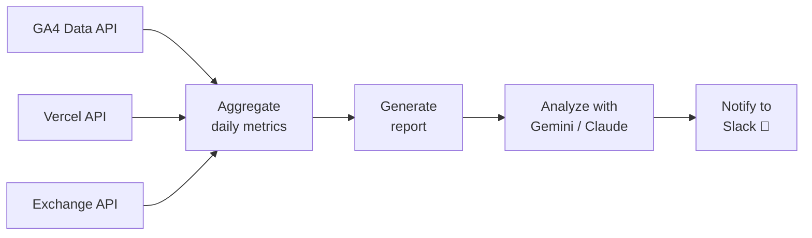

# P.V.V.C

<div align="center">
    
    <h3 align="center">Page Views Vercel Cost</h3>


[](https://github.com/4okimi7uki/pvvc/actions/workflows/lint.yml)
[](https://github.com/4okimi7uki/pvvc/releases)


GA4のページビューとVercelのホスティングコストを取得・比較し、
**トラフィックとコストのバランスを可視化・分析する** CLIツール

</div>

---

## Overview

**P.V.V.C** は、GA4のPVとVercelのホスティングコストを並べて見ながら、
日々のトラフィック推移とコスト効率を把握するためのCLIツールです。

日別レポートの出力に加えて、為替レートを用いたJPY換算、
Gemini / Claude による分析コメント生成、Slack通知まで自動化できます。

---

## Features

- 直近7日分の **GA4 PV / Vercel Cost / USDJPY** を自動取得（`--from` / `--to` で期間変更可能）
- 日別メトリクスを **CLIテーブル** で見やすく表示
- **Cost per PV** を算出し、コスト効率を可視化
- **GA4 アクセスランキング** を表示（`--top-pages` で取得件数を指定可能）
- **Gemini / Claude** によるトレンド分析コメントを生成（`--llm` で切り替え可能）
- Slack への通知に対応（サマリー・コスト内訳・AI分析・Vercel リンク・GA4ページリンク）
- `pvvc init` による **インタラクティブな初期設定**（既存設定を prefill した edit mode 対応）
- `.env` または `~/.config/pvvc/config.toml` で設定可能

---

## Architecture


```mermaid
flowchart LR
    GA4[GA4 Data API]
    Vercel[Vercel API]
    Exchange[Exchange API]

    Agg["Aggregate\ndaily metrics"]
    Report["Generate\nreport"]
    Gemini["Analyze with\nGemini / Claude"]
    Slack["Notify to\nSlack 🔔"]

    GA4 --> Agg
    Vercel --> Agg
    Exchange --> Agg
    Agg --> Report
    Report --> Gemini
    Gemini --> Slack
```

## Flow

1. **Load configuration**
   - 環境変数 / `.env` / `~/.config/pvvc/config.toml` から認証情報を読み込みます（優先度順）

2. **Fetch metrics**
   - GA4 Data API からページビューを取得
   - Vercel API からホスティングコストを取得
   - 為替APIから USD/JPY レートを取得

3. **Build report**
   - 日別データを集計し、ターミナル上に表形式で出力します

4. **Analyze trends**
   - Gemini に集計データを渡し、傾向や変化点のコメントを生成します

5. **Send notification**
   - サマリーと分析結果を Slack Incoming Webhook で送信します

---

## Configuration

### 推奨: pvvc init

インタラクティブな初期設定コマンドで、認証情報を対話形式で入力できます。
設定は `~/.config/pvvc/config.toml` に保存されます。

```bash
pvvc init
```

### 手動設定: 環境変数 / .env

プロジェクトルートに `.env` を作成するか、環境変数として設定してください。
環境変数は `.config` ファイルより優先されます。

```env
# Vercel
VERCEL_TOKEN=<Vercel API Token>
TEAM_ID=<Vercel Team ID>
PROJECT_ID=<Vercel Project ID>        # 単一プロジェクトの場合
PROJECT_IDS=<id1,id2,id3>             # 複数プロジェクトを集計する場合（カンマ区切り）
VERCEL_PROJECT_URL=<https://vercel.com/your-team/your-project>   # 任意: Slack 通知に Usage・Logs へのリンクを追加

# Google Analytics 4
PROPERTY_ID=<GA4 Property ID>
GOOGLE_ANALYTICS_CREDENTIAL=<Service Account JSON string>

# AI
GEMINI_API_KEY=<Gemini API Key>
CLAUDE_API_KEY=<Claude API Key>

# Slack
SLACK_WEBHOOK_URL=<Incoming Webhook URL>

# site name
TARGET_WEBSITE_NAME=<Website Name>

# site base URL (任意: Slack 通知のGA4ページリンクに使用)
BASE_URL=<https://www.example.com>
```

> **設定の優先度:** 環境変数 / `.env` > `~/.config/pvvc/config.toml`

---

## Usage

### Initialize configuration

```bash
pvvc init
```

### Generate daily report

```bash
pvvc report
```

### Run AI analysis

```bash
# Gemini（デフォルト）
pvvc analyze

# Claude を使う場合
pvvc analyze --llm claude
```

### Send analysis to Slack

```bash
pvvc analyze --notify
pvvc analyze --llm claude --notify
```

Slack 通知には以下が含まれます:

- サマリー（PV・コスト・為替レート等）
- AI 分析コメント（Gemini / Claude アイコン付き）
- サービス別コスト内訳（前日分）
- `VERCEL_PROJECT_URL` を設定した場合は Usage・Logs へのリンク
- GA4 アクセスランキングの各ページをリンク付きで表示

### Suppress terminal output (quiet mode)

```bash
pvvc report --quiet
pvvc analyze --notify --quiet
```

---

## Commands

| Command        | Description                            |
| -------------- | -------------------------------------- |
| `pvvc init`    | 認証情報をインタラクティブに設定       |
| `pvvc report`  | 直近7日分のPV・コストレポートを出力    |
| `pvvc analyze` | AIによるトラフィック・コスト分析を実行 |

## Flags

| Flag          | Short | Default  | Description                                       |
| ------------- | ----- | -------- | ------------------------------------------------- |
| `--from`      | -     | 8日前    | 対象期間の開始日 (e.g. `2006-01-02`)              |
| `--to`        | -     | 昨日     | 対象期間の終了日 (e.g. `2006-01-03`)              |
| `--top-pages` | -     | `20`     | GA4 アクセスランキングの表示件数                  |
| `--quiet`     | `-q`  | `false`  | ターミナルへの結果出力を抑制                      |
| `--notify`    | -     | `false`  | 分析/集計結果をSlackに通知                        |
| `--svg`       | -     | -        | コスト×PVのグラフをSVGで出力（下記参照）          |
| `--html`      | -     | -        | 上記グラフを埋め込んだHTMLを出力（下記参照）      |
| `--llm`       | -     | `gemini` | 使用するLLM (`gemini` / `claude`) (`analyze`のみ) |

### `--svg`

日次コスト（棒）と PV（折れ線）を重ねた二軸グラフを SVG で書き出します。値は省略可能です。

```bash
pvvc report --svg                    # ./pvvc_svg/pvvc-20260501_20260726.svg に出力
pvvc report --svg=docs/cost.svg      # パス指定（pvvc_svg/ は使わず、ディレクトリは自動で作成）
pvvc report --svg=- > chart.svg      # 標準出力に流す
```

値をスペース区切りでは渡せません（`--svg out.svg` ではなく `--svg=out.svg`）。
`--svg=-` のときはターミナル向けの出力が標準エラー出力に切り替わるので、そのままパイプできます。

### `--html`

同じグラフを SVG のまま埋め込んだ HTML を書き出します。使い方は `--svg` と同じです。

```bash
pvvc report --html                   # ./pvvc_html/pvvc-20260501_20260726.html に出力
pvvc report --html=docs/index.html   # パス指定（ディレクトリは自動で作成）
pvvc report --html=- > chart.html    # 標準出力に流す
```

`--svg` との併用は可能ですが、`--svg=-` と `--html=-` の同時指定は
標準出力で混ざるためエラーになります。

---

<small>2026 Aoki Mizuki – Developed with 🍭 and a sense of fun.</small>
