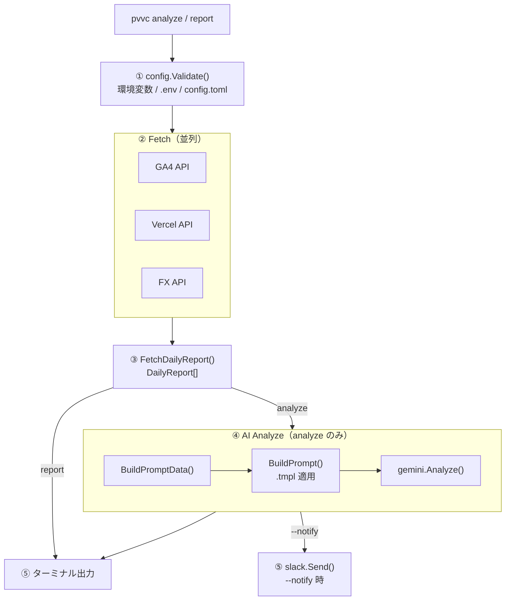

# Architecture

pvvc のパッケージ構成とデータフローを説明します。

---

## Directory Structure

```
pvvc/
├── cmd/                  # CLI コマンド定義（cobra）
│   ├── root.go           # ルートコマンド・グローバルフラグ
│   ├── report.go         # pvvc report
│   ├── analysis.go       # pvvc analyze
│   └── init.go           # pvvc init
├── internal/
│   ├── app/              # コマンドのオーケストレーション
│   │   ├── run.go        # RunMain / RunAnalysis
│   │   ├── setup.go      # pvvc init のフォーム処理
│   │   └── theme.go      # Charm UI テーマ定義
│   ├── config/           # 設定の読み込み・バリデーション
│   ├── datasource/
│   │   ├── ga4/          # GA4 Data API クライアント
│   │   ├── vercel/       # Vercel Billing API クライアント
│   │   └── fx/           # 為替レート取得（Frankfurter API）
│   ├── ai/               # AI 分析
│   │   ├── models.go     # PromptData / ReportRow 型定義
│   │   ├── prompt.go     # プロンプトのビルド（テンプレート処理）
│   │   └── gemini/       # Gemini クライアント実装
│   ├── report/           # レポートの集計・整形・表示
│   ├── slack/            # Slack Incoming Webhook 送信
│   ├── ui/               # ターミナル UI（カラー・スピナー・ロゴ）
│   ├── retry/            # 指数バックオフによるリトライ
│   └── gh/               # GitHub リリース確認（バージョンチェック）
├── prompts/
│   └── analyze.tmpl      # Gemini へ渡すデフォルトプロンプトテンプレート
├── assets/               # ロゴ等
├── lefthook.yml          # Git フック設定
└── Makefile
```

---

## Data Flow



---

## Key Packages

### `internal/app`

コマンドのエントリーポイントから呼び出されるオーケストレーション層です。  
`RunMain()` でデータ取得と集計、`RunAnalysis()` で AI 分析を担当します。  
cobra コマンドのロジックを直接書かず、ここに集約することでテストしやすい構造になっています。

### `internal/datasource`

外部 API との通信を担当します。各サブパッケージは独立しており、  
GA4・Vercel・FX それぞれが `errgroup` で並列実行されます。

### `internal/ai`

プロンプトのビルドと Gemini との通信を分離しています。

- `prompt.go` — テンプレートファイル（ローカルパスまたは URL）を読み込み、`PromptData` を埋め込んで文字列を生成
- `gemini/client.go` — Gemini API の呼び出し。レートリミット（429/503）時は次のモデルへフォールバックし、各モデルで最大3回リトライ

**Gemini モデルのフォールバック順:**

```
gemini-3-flash-preview
  → (rate limit) gemini-3.1-flash-lite-preview
    → (rate limit) gemini-2.5-flash
```

新しいモデルが追加されたら `internal/ai/gemini/client.go` の `geminiModels` スライスを更新してください。

### `internal/config`

設定値の優先度は以下の通りです（高い順）:

1. 環境変数
2. `.env` ファイル（godotenv）
3. `~/.config/pvvc/config.toml`

Vercel のプロジェクト ID は `GetProjectIDs()` で解決されます。  
`PROJECT_IDS`（カンマ区切り）→ `PROJECT_ID`（単一）の順で参照し、どちらも未設定の場合は `nil` を返します。  
複数 ID を指定するとそれらのコストが合算されてレポートに反映されます。

### `prompts/analyze.tmpl`

Go の `text/template` 形式のプロンプトテンプレートです。  
`--prompt` フラグでローカルファイルパスまたは HTTPS URL を指定することで差し替え可能です。  
デフォルトは `prompts/analyze.tmpl` にフォールバックします。

利用できるテンプレート変数:

| 変数              | 型          | 内容                                         |
| ----------------- | ----------- | -------------------------------------------- |
| `.ServiceName`    | string      | サービス名（`service.name` の値）            |
| `.Today`          | string      | 本日の日付（`2006年01月02日` 形式）          |
| `.TableHeader`    | string      | データテーブルのヘッダー行                   |
| `.Rows`           | []ReportRow | 日別データ行（`.Line` フィールドを持つ）     |
| `.NewsURLs`       | []string    | ゴルフニュースソースの URL 一覧              |
| `.IsBeforeCutoff` | bool        | Vercel 課金データ確定前（UTC 7:00 より前）か |
| `.HasAnomaly`     | bool        | 直近コストが前日比 1.3 倍以上の異常値か      |
